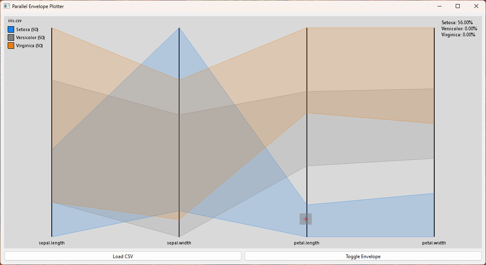
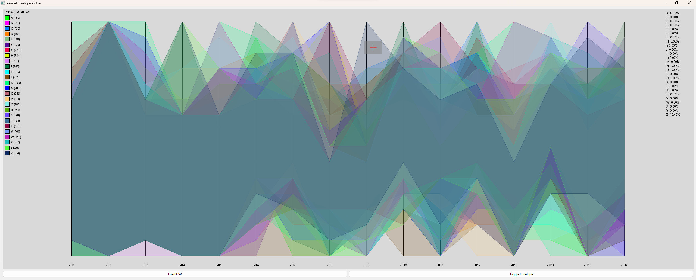

# EnvelopePlotter

Parallel Coordinates visualization tool for multivariate CSV data and envelope exploration. WIP

Plot examples of Wisconsin Breast Cancer Diagnosis dataset.

Exploring the Fisher Iris dataset Setosa class.

MNIST dataset of capital letters in English.

